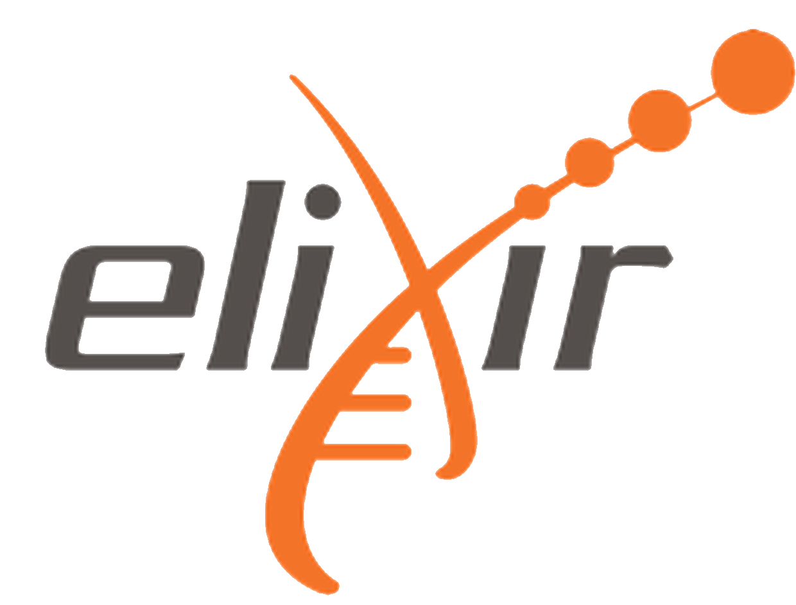
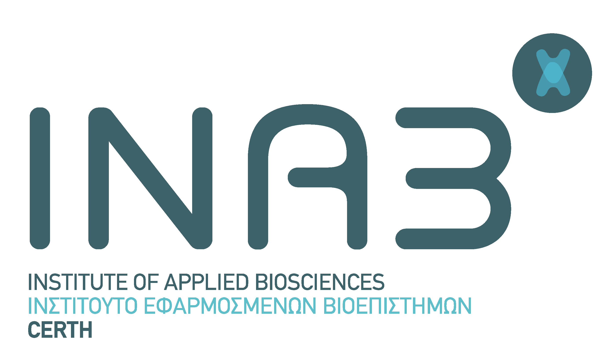

  
  
  

  

## Overview of the Material for the [BC]2 2019 workshop

**When**: September 9th, 09:00 to 16:00

**Where**: University of Basel, [Kollegienhaus building, Petersplatz 1](https://www.google.ch/maps/place/Petersplatz+1,+4051+Basel/@47.5584029,7.5825258,17.67z/data=!4m13!1m7!3m6!1s0x4791b9a96c44bba1:0xe0a7bc8b66787bdb!2sPetersplatz+1,+4051+Basel!3b1!8m2!3d47.5586129!4d7.5827926!3m4!1s0x4791b9a96c44bba1:0xe0a7bc8b66787bdb!8m2!3d47.5586129!4d7.5827926), CH-4001 Basel

**Room**: Regenzzimmer 111

### Organisers and tutors

[**Amel Ghouila**](https://amelgh.github.io/), [H3ABioNet](https://www.h3abionet.org/)

[**Fotis Psomopoulos**](https://fpsom.github.io/), [INAB-CERTH](http://inab.certh.gr), ELIXIR-GR

### Overview
Machine learning has emerged as a discipline that enables computers to assist humans in making sense of large and complex data sets. With the drop-in cost of sequencing technologies, large amounts of omics data are being generated and made accessible to researchers. Analysing these complex high-volume data is not trivial and the use of classical tools cannot explore their full potential. Machine learning can thus be very useful in mining large omics datasets to uncover new insights that can advance the field of medicine and improve health care.

The aim of this tutorial is to introduce participants to the Machine learning (ML) taxonomy and common machine learning algorithms. The tutorial will cover the methods being used to analyse different omics data sets by providing a practical context through the use of basic but widely used R and Python libraries. The tutorial will comprise a number of hands on exercises and challenges, where the participants will acquire a first understanding of the standard ML processes as well as the practical skills in applying them on familiar problems and publicly available real-world data sets.

### Learning objectives

- Understand the ML taxonomy and the commonly used machine learning algorithms for analysing “omics” data
- Understand differences between ML algorithms categories and to which kind of problem they can be applied
- Understand different applications of ML in different -omics studies
- Use some basic, widely used Python and R packages for ML
- Interpret and visualize the results obtained from ML analyses on omics datasets
- Apply the ML techniques to analyse their own datasets

### Audience and requirements

This introductory tutorial is aimed towards bioinformaticians (graduate students and researchers) familiar with different omics data technologies that are interested in applying machine learning to analyse them.

### Prerequisites

- Previous experience in Bioinformatics analysis
- Familiarity with any programming language (especially R) is preferable but not necessary

_Maximum participants_: 30

### Schedule

| Time  |  Details |
|--------|----------|
| 09:00 - 09:15	| **Tutorial introduction**.     - Get to know each other.   - Setup   [_Link to material_](episodes/setup.md) |
| Part I: Background | |
| 09:15 - 10:45	| **Introduction to ML / DM**.    - Data Mining.  - Machine Learning basic concepts.  - Taxonomy of ML and examples of algorithms.   - Deep learning overview.   [_Link to material_](episodes/01-intro.md)
| 11:00 - 12:30	| **Applications of ML in Bioinformatics**.   - Examples of different ML/DM techniques that can be applied to different NGS data analysis pipelines.   - How to choose the right ML technique?   [_Link to material_](episodes/02-bioinformatics-and-ml.md) |
| Part II: Hands-on | |
| 13:15 - 14:45 | **Loading and exploring omics data**.   - What is Exploratory Data Analysis (EDA) and why is it useful?   - Unsupervised Learning.   - How could unsupervised learning be used to analyze omics data?   [_Link to material_](episodes/03-eda-unsupervised-learning.md) |
| 15:00 - 16:30	| **Supervised Learning**    **_Classification_**.   - How could supervised learning be used to analyze omics data.   **_Regression_**.   - What if the target variable is numerical rather than categorical?   [_Link to material_](episodes/04-supervised-learning.md) |
| 16:30	| Closing, discussion and resource sharing|

## Other examples

If you finish all the exercices and wish to practice on more examples, here are a couple of good examples to help you get more familiar with the different ML techniques and packages.
1. [RNASeq Analysis in R](https://combine-australia.github.io/RNAseq-R/06-rnaseq-day1.html)
2. [Use the Iris R built-in data set](https://github.com/fpsom/CODATA-RDA-Advanced-Bioinformatics-2019/blob/master/3.Day3.md)to run clustering and also some supervised classification and compare results obtained by different methods.

## Sources / References

The material in the workshop has been based on the following resources:

1. [ELIXIR CODATA Advanced Bioinformatics Workshop](https://codata-rda-advanced-bioinformatics-2019.readthedocs.io)
2. [Machine Learning in R](https://hugobowne.github.io/machine-learning-r/), by [Hugo Bowne-Anderson](https://twitter.com/hugobowne) and [Jorge Perez de Acha Chavez](https://twitter.com/jorge_pda)
3. [Practical Machine Learning in R](https://leanpub.com/practical-machine-learning-r), by [Kyriakos Chatzidimitriou](https://leanpub.com/u/kyrcha), [Themistoklis Diamantopoulos](https://leanpub.com/u/thdiaman), [Michail Papamichail](https://leanpub.com/u/mpapamic), and [Andreas Symeonidis](https://leanpub.com/u/symeonid).
4. [Linear models in R](https://monashbioinformaticsplatform.github.io/r-linear/topics/linear_models.html), by the [Monash Bioinformatics Platform](https://www.monash.edu/researchinfrastructure/bioinformatics)
5. Relevant blog posts from the [R-Bloggers](https://www.r-bloggers.com/) website.

Relevant literature includes:

1. [Pattern Recognition and Machine Learning](http://users.isr.ist.utl.pt/~wurmd/Livros/school/Bishop%20-%20Pattern%20Recognition%20And%20Machine%20Learning%20-%20Springer%20%202006.pdf) by Christopher M. Bishop.
2. [Machine learning in bioinformatics](https://academic.oup.com/bib/article/7/1/86/264025), by Pedro Larrañaga et al.
3. [Ten quick tips for machine learning in computational biology](https://biodatamining.biomedcentral.com/articles/10.1186/s13040-017-0155-3), by Davide Chicco
3. [Statistics versus machine learning](https://www.nature.com/articles/nmeth.4642)
4. [Machine learning and systems genomics approaches for multi-omics data](https://biomarkerres.biomedcentral.com/articles/10.1186/s40364-017-0082-y)
5. [A review on machine learning principles for multi-view biological data integration](https://academic.oup.com/bib/article/19/2/325/2664338)

## License

This material is made available under the [Creative Commons Attribution 4.0 International license](https://creativecommons.org/licenses/by/4.0). Please see [LICENSE](LICENSE.md) for more details.

## Citation

Amel Ghouila, & Fotis E. Psomopoulos. (2019, September 9). Introduction to Machine Learning: Opportunities for advancing omics data analysis (Version v1.0.0). Zenodo. http://doi.org/10.5281/zenodo.3403768
